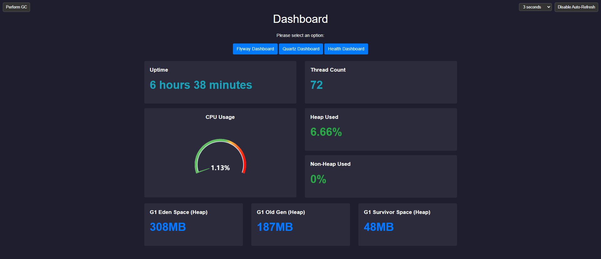
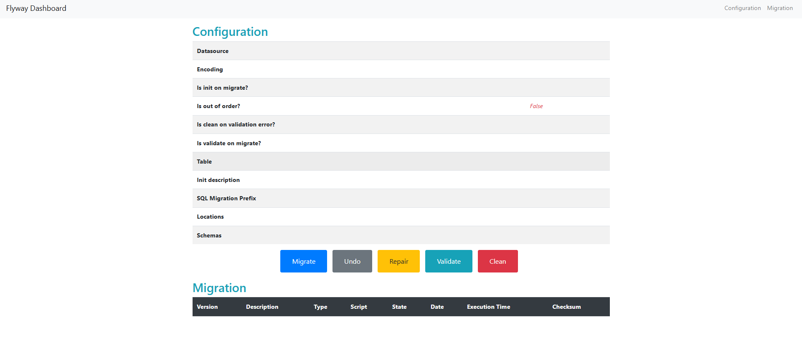
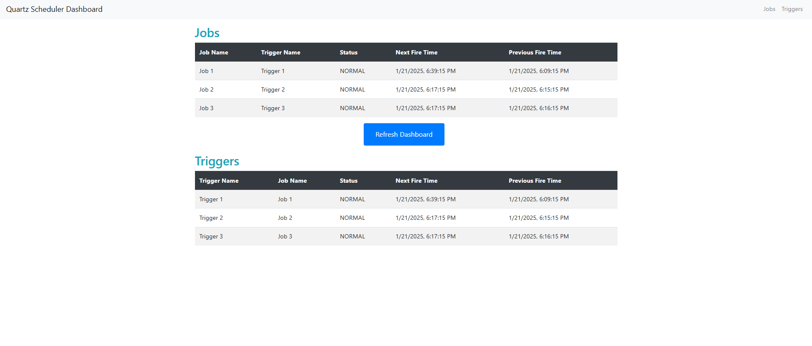
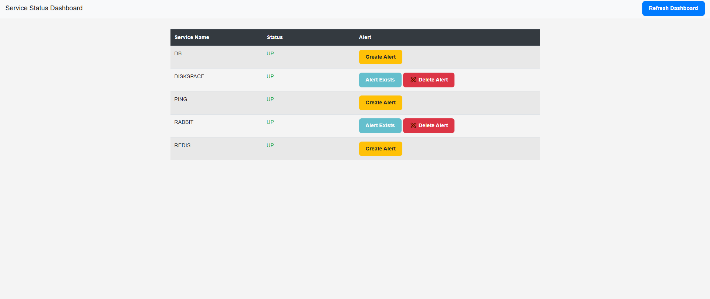

---

# Dashboard Project

This project provides a web-based dashboard for managing Flyway database migrations and Quartz job scheduling. It includes the following components:



- **Flyway Dashboard**: Manage and monitor Flyway database migrations.



- **Quartz Scheduler Dashboard**: Manage and monitor Quartz job scheduling.



- **Health Dashboard**: Display the health of application components.



## Features

- User-friendly interface for database migration and job scheduling.
- Centralized navigation through a unified dashboard.
- Real-time health monitoring of application components.

## Technologies Used

- **Frontend**: HTML, CSS (Bootstrap 4.3.1), JavaScript (jQuery)
- **Backend**: Spring Framework
- **Build Tool**: Maven

## Prerequisites

- **Java**: Version 17 or higher
- **Maven**: Version 3.6.0 or higher
- **Spring Boot**: Version 3.0 or higher

## Installation

### 1. Add Dependency

Add the following dependency to your `pom.xml` file:

```xml
<dependency>
    <groupId>io.github.arefbehboudi</groupId>
    <artifactId>ui-tools</artifactId>
    <version>0.1.8</version>
</dependency>
```

### 2. Install the Project

Run the following command from the root directory of the project:

```bash
mvn install
```

### 3. Configure Your Spring Application

Add the following configuration to your Spring application:

```java
@Configuration
public class WebMvcConfiguration extends WebMvcConfigurationSupport {

    @Override
    protected void addResourceHandlers(ResourceHandlerRegistry registry) {
        registry.addResourceHandler("/dashboard-ui/**")
                .addResourceLocations("classpath:/META-INF/resources/WEB-INF/views/")
                .setCachePeriod(0)
                .resourceChain(false)
                .addResolver(new DashboardResourceSolver());
    }
}
```

## Accessing the Dashboard

Once the application is running, open your web browser and navigate to:

```
http://localhost:<port>/dashboard-ui/dashboard.html
```

Replace `<port>` with your application's running port.

---

